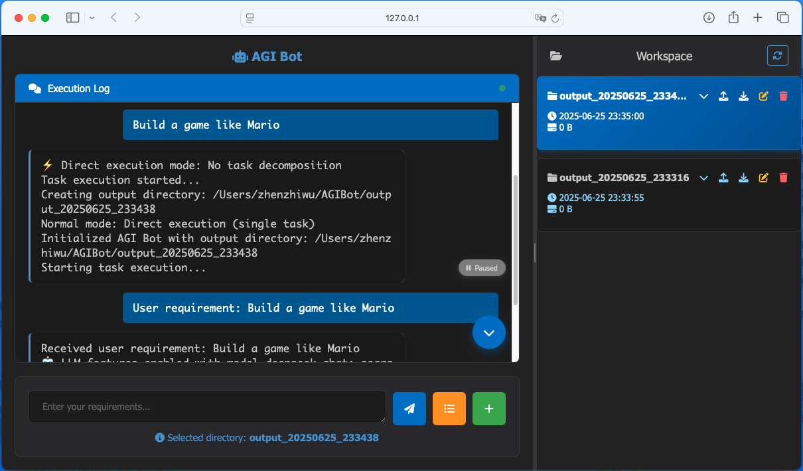

# AGI Bot GUI

Graphical user interface for AGI Bot, providing intuitive and convenient task execution and file management functions.

## 🚀 Quick Start

### Launch GUI, execute in the project root directory:
```bash
python GUI/app.py
```

After startup, visit: `http://localhost:5001`

## Interface Example
<div align="center">
      
</div>

## Usage

You can create a new workspace or select an existing one, upload data files that need to be processed through the workspace upload button, write your requirements, and click the execute button to run. The program will execute up to 25 iterations. After completion, you can view the generated files in the workspace and download the workspace by clicking the download button. During execution and after completion, you can preview the files that have been generated.

When selecting a workspace, make sure to click it to highlight it in blue.

After task execution is completed or interrupted, you can continue the task by selecting the workspace and entering a prompt. However, note that the previous round's requirements and execution process are not carried over to the current run.

## 🔧 Configuration

### Environment Requirements
- Python 3.8+
- Flask
- Flask-SocketIO
- Other dependencies see requirements.txt

### Configuration File
The GUI reads the `config.txt` configuration from the main directory:
- `language`: Interface language (zh/en)
- `gui_default_data_directory`: GUI data directory path 