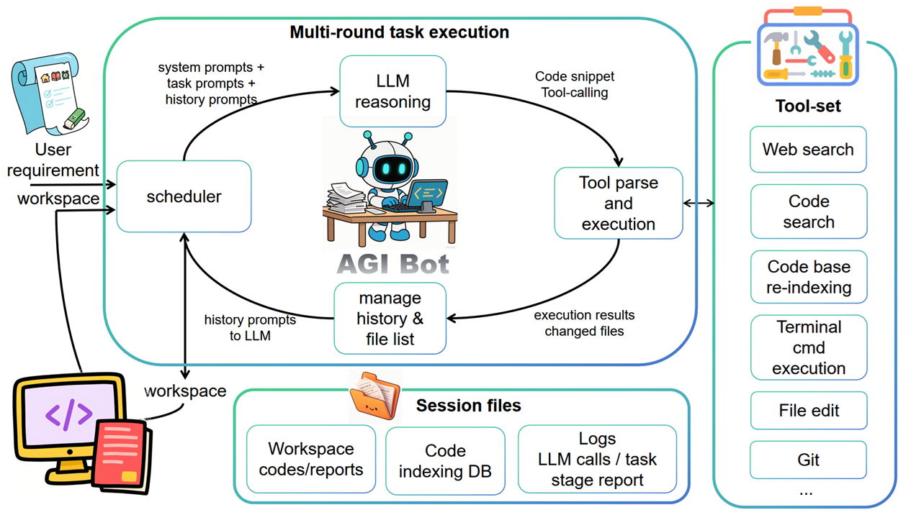

# AGI Bot

[**中文**](README_zh.md) | **English**

**AGI Bot** is an AI-powered intelligent code generation and autonomous task execution system that automatically decomposes complex tasks and completes them through multi-round iterations with tool calls.

AGI Bot takes user prompts and a working directory as input, and outputs an edited working directory where the LLM places code, documentation, and other output files in the workspace folder. AGI Bot operates in a multi-round iterative mode, where each round represents an interaction process between the LLM and tools. The system sends system prompts, user prompts, chat history, and previous tool execution results to the LLM, which then autonomously decides on the next round of tool calls (such as writing files, searching code repositories, executing terminal commands, etc.). These calls are described in XML format and then parsed and executed by the tool execution module. The execution results are passed to the LLM in the next round. When the LLM determines that the task is complete, it sends a task completion signal, and the program can optionally perform task summarization. All LLM editing operations are completed in the workspace directory under the user-defined working directory (out-dir). Additionally, to control context length, chat history summarization is triggered when the chat context threshold is exceeded. Web search results can optionally be summarized.

AGI Bot runs in the terminal by default. For users with GUI or web access needs, we also provide a Web GUI that includes all the functionality needed for task execution, plus file upload/download, file preview, and task execution monitoring features.

Since AGI Bot is positioned as a general-purpose task agent, it may call system terminal commands. It generally does not operate files outside the working directory, though the LLM may sometimes call software installation commands (pip, apt, etc.). Please use this software with caution and consider sandbox execution when necessary.

<div align="center">
      
  
  **🚀 Autonomous Programming & Task Execution System**
  
  *LLM-driven autonomous code generation with intelligent task decomposition and multi-round iterative execution capabilities*
</div>

<br/>

## Quick Start

#### 🔥 Single Task Mode (Recommended)
Perfect for bug fixes, feature optimizations, and focused objectives. If you don't specify the `-r` parameter, the program will prompt you to enter a task description, supporting multi-line complex prompts.

```bash
python main.py --requirement "Search today's news"
python main.py -r "Write a joke"
```

#### 📋 Task Decomposition Mode
Ideal for complex multi-step tasks where the system automatically breaks down large tasks into manageable subtasks.

```bash
python main.py --r "Search today's news" --todo --requirement "Develop a complete blog system"
```

#### 💬 Interactive Mode
Provides a more flexible interactive experience with guided task input.

```bash
python main.py -i
python main.py --interactive --todo
```

#### 📁 Custom Output Directory
Specify custom project output location. If not specified, the system automatically creates a timestamped `output_` directory.

```bash
python main.py --out-dir "my_project"
```

#### 🔄 Resume Task Execution
Resume previous tasks for continued execution. AGI Bot remembers the last used output directory.

```bash
python main.py -c
python main.py --continue
```

> **Note**: Resuming execution doesn't restore chat history or previous requirement prompts, but can continue operating on files in the working directory.

#### ⚡ Set Execution Rounds
Control the maximum number of task execution rounds to prevent infinite loops.

```bash
python main.py --loops 5 -r "Task description"
python main.py -o "my_dir" -l 10 -r "Task description"
```

> **Info**: Rounds don't equal model calls. Each round typically calls the LLM once, but additional calls may occur for history summarization when chat logs become too long, plus optional task summarization at completion.

#### 🔧 Custom Model Configuration
Specify API configuration directly via command line, though we recommend configuring in `config.txt` for reusability.

```bash
python main.py --api-key YOUR_KEY --model gpt-4 --api-base https://api.openai.com/v1
```

## 🎯 Core Features

- **🧠 Intelligent Task Decomposition**: AI automatically breaks down complex requirements into executable subtasks
- **🔄 Multi-Round Iterative Execution**: Each task supports multiple optimization rounds ensuring quality (default 25 rounds)
- **🔍 Smart Code Search**: Semantic search + keyword search for rapid code location
- **🌐 Web Search Integration**: Real-time web search for latest information and solutions
- **📚 Codebase Retrieval**: Advanced code repository analysis and intelligent code indexing
- **🛠️ Rich Tool Ecosystem**: Complete local tools + OS command invocation capabilities supporting full development workflows
- **🖥️ Web Interface**: Intuitive web interface with real-time execution monitoring
- **📊 Dual-Format Reports**: JSON detailed logs + Markdown readable reports
- **⚡ Real-Time Feedback**: Detailed execution progress and status display
- **🤝 Interactive Control**: Optional user confirmation mode with step-by-step control
- **📁 Flexible Output**: Custom output directories with automatic timestamp naming for new projects

## 🌐 Web Search Functionality

AGI Bot integrates powerful web search capabilities for real-time information retrieval:

**Usage**: Include "search web" in your requirement prompt to enable searching, or "don't search web" to disable it. If not specified, the LLM will decide autonomously.

## 📚 Codebase Retrieval System

AGI Bot features real-time codebase vectorization and retrieval functionality. After each tool call round, it searches for newly modified files, performs dynamic incremental indexing, and supports the LLM's fuzzy semantic search capabilities. Additionally, the LLM can call commands like grep to observe workspace conditions.

## 🛠️ Tool Library

AGI Bot provides a comprehensive tool library:

### File System Tools
- **File Operations**: Create, read, update, delete files and directories
- **Directory Management**: Navigate and organize project structures
- **File Search**: Find files by name, content, or patterns

### Code Analysis Tools
- **Syntax Analysis**: Parse and understand code structures
- **Dependency Analysis**: Map code relationships and imports
- **Code Quality**: Identify issues and suggest improvements

### Network & Web Tools
- **Web Search**: Real-time information retrieval
- **API Testing**: Test and validate API endpoints
- **Documentation Fetching**: Retrieve technical documentation

### Terminal & Execution Tools
- **Command Execution**: Run system commands and scripts
- **Process Management**: Monitor and control running processes
- **Environment Setup**: Configure development environments

### Development Tools
- **Code Generation**: Create boilerplate and template code
- **Testing Tools**: Generate and run test cases
- **Build Tools**: Compile and package applications

## 🖥️ Web GUI Interface

AGI Bot provides a modern, intuitive web interface to enhance user experience:

### Key Features
- **Real-Time Execution Monitoring**: Live observation of task execution and detailed logs
- **Interactive Task Management**: Start, stop, and monitor tasks through the web interface
- **File Management**: Upload, download, and manage project files directly in the browser
- **Directory Operations**: Create, rename, and organize project directories
- **Multi-Language Support**: Chinese and English interfaces available (configure in config.txt)

### Launch GUI
```bash
cd GUI
python app.py

# Access via browser at http://localhost:5001
```

The Web GUI displays file lists. By default, folders with workspace subdirectories are listed, while others are not. The root directory location can be configured in config.txt.

> **Note**: The Web GUI is currently experimental, providing only a single-user development version (not suitable for industrial deployment).

## 🤖 Model Selection

AGI Bot supports multiple AI models to meet different user needs and budgets. Choose the model that best fits your requirements:

### 🌟 Recommended Models

#### Claude Sonnet 4 (Recommended)
**Best for: Complex tasks requiring high accuracy and detailed responses**
- ✅ **Pros**: High intelligence, excellent accuracy, detailed responses
- ❌ **Cons**: Expensive, moderate speed, occasional hallucinations
- 💰 **Pricing**: Premium tier
- 🎯 **Use Cases**: Complex code generation, detailed analysis, advanced problem-solving

#### OpenAI GPT-4.1
**Best for: Users needing fast, reliable performance**
- ✅ **Pros**: Good accuracy, fast speed
- ❌ **Cons**: Expensive (but cheaper than Claude Sonnet 4)
- 💰 **Pricing**: Premium tier (more economical than Claude)
- 🎯 **Use Cases**: General development tasks, rapid iteration, balanced performance needs

#### DeepSeek V3
**Best for: Cost-conscious users prioritizing accuracy**
- ✅ **Pros**: Accurate, minimal hallucinations, conservative, affordable
- ❌ **Cons**: More concise output, less detailed explanations
- 💰 **Pricing**: Budget-friendly
- 🎯 **Use Cases**: Code optimization, bug fixes, direct implementation tasks

#### Qwen2.5-7B-Instruct (SiliconFlow)
**Best for: Free trial users and simple tasks**
- ✅ **Pros**: Very affordable (free), capable of handling simple tasks
- ❌ **Cons**: Frequently searches web, sometimes inaccurate strategy selection, mediocre task handling
- 💰 **Pricing**: Free
- 🎯 **Use Cases**: Learning experiments, basic code generation, simple task processing

### 💡 Model Selection Guide

| Model | Intelligence | Response Speed | Cost | Best For |
|-------|-------------|----------------|------|----------|
| Claude Sonnet 4 | ⭐⭐⭐⭐⭐ | ⭐⭐⭐ | 💰💰💰💰 | Complex projects |
| GPT-4.1 | ⭐⭐⭐⭐ | ⭐⭐⭐⭐⭐ | 💰💰💰 | General development |
| DeepSeek V3 | ⭐⭐⭐⭐ | ⭐⭐⭐⭐ | 💰💰 | Budget projects |
| Qwen2.5-7B | ⭐⭐⭐ | ⭐⭐⭐ | Free | Simple tasks |

### 🔧 Model Configuration

Configure your preferred model in the `config.txt` file or use command line parameters:

```bash
# Using Claude Sonnet 4
python main.py --model claude-3-5-sonnet-20241022 --api-key your_key -r "Your task"

# Using OpenAI GPT-4.1
python main.py --model gpt-4 --api-key your_key -r "Your task"

# Using DeepSeek V3
python main.py --model deepseek-chat --api-base https://api.deepseek.com --api-key your_key -r "Your task"

# Using SiliconFlow (Free)
python main.py --model Qwen/Qwen2.5-7B-Instruct --api-base https://api.siliconflow.cn/v1 --api-key your_free_key -r "Your task"
```

## ⚙️ Configuration File (config.txt)

AGI Bot uses a `config.txt` file for system configuration. Below are the main configuration options:

### API Configuration
```ini
# Choose your preferred AI service provider
# OpenAI API
api_key=your_openai_api_key
api_base=https://api.openai.com/v1
model=gpt-4

# Anthropic Claude
api_key=your_anthropic_api_key
api_base=https://api.anthropic.com
model=claude-3-sonnet-20240229

# Other supported providers: SiliconFlow, DeepSeek, Volcengine Doubao, Ollama
```

### Language Settings
```ini
# Interface language: en for English, zh for Chinese
LANG=en
```

### Output Control
```ini
# Streaming output: True for real-time output, False for batch output
streaming=True

# Simplified search result display
simplified_search_output=True

# Generate summary reports
summary_report=False
```

### Content Truncation Settings
```ini
# Main tool result truncation length (default: 10000 characters)
truncation_length=10000

# History truncation length (default: 10000 characters)
history_truncation_length=10000

# Web content truncation length (default: 50000 characters)
web_content_truncation_length=50000
```

### History Summary Feature
```ini
# Enable AI-powered conversation history summarization
summary_history=True

# Summary maximum length (default: 5000 characters)
summary_max_length=5000

# Trigger summary when history exceeds this length
summary_trigger_length=30000

# Silent mode
# Add -quiet or -y flags to sudo, pip commands, disabled by default
auto_fix_interactive_commands=False
# Note: For successful sudo calls by LLM, use non-silent mode and manually enter sudo password, 
# or use silent mode with sudoers file authorization (e.g., your_username ALL=(ALL) NOPASSWD: /usr/bin/apt-get)
```

### GUI Configuration
```ini
# Default directory for GUI file management
gui_default_data_directory=~
```

## 🔧 System Requirements

- **Python 3.8+**
- **Dependencies**: requests, openai, anthropic, colorama, pandoc
- **Additional GUI Dependencies**: flask, flask-socketio (optional if GUI not needed)
- **Optional Enhancements**: numpy, scikit-learn, playwright (auto-installed)
- **Network Connection**: Required for API calls and web search functionality

## 🎯 Best Practices

### Requirement Description Tips
- **Be Specific**: Describe concrete functionality rather than vague concepts
- **Include Context**: Specify tech stack and environment requirements
- **Layer Description**: Complex requirements can be described hierarchically

### Mode Selection Guide
- **Single Task Mode** (`--singletask`, default):
  - Bug fixes, code optimization, feature improvements
  - Targeted problem solving
  - Quick implementation of simple requirements
  
- **Multi-Task Mode** (`--todo`):
  - Complete project development
  - Complex system design
  - Multi-feature integration requirements

- **Interactive Mode** (`-i`):
  - Dynamic requirement adjustments needed
  - Learning and exploration phases
  - Fine-grained process control requirements

### Parameter Configuration Recommendations
- **Simple Tasks**: 1-5 execution rounds (`--loops 5`)
- **Complex Tasks**: 10-25 execution rounds (default)
- **Debug Phase**: Use `--debug` mode to output llm_call_* files for viewing detailed LLM conversations
- **Large Projects**: Use custom output directory (`--out-dir project_name`)

---

## 📄 License

This project is licensed under the MIT License - see the [LICENSE](LICENSE) file for details.

## 🤝 Contributing

Contributions are welcome! Please feel free to submit a Pull Request.

## 📞 Support

If you encounter any issues or have questions, please open an issue on GitHub.

---

*AGI Bot - Empowering developers with AI-driven autonomous programming capabilities* 🚀 