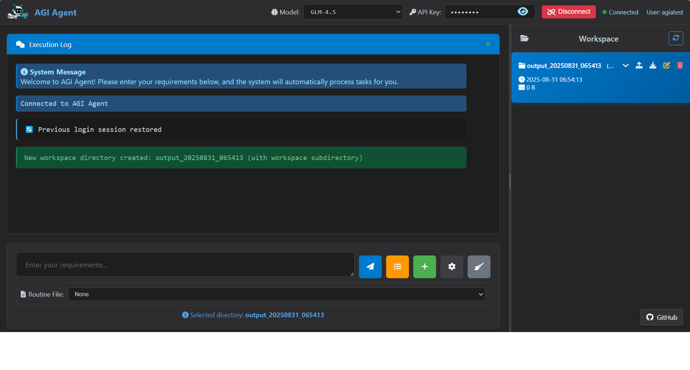

# AGI Agent

[**中文**](README_zh.md) | **English**

## 🚀 Project Introduction
**AGI Agent** is a versatile platform for general-purpose tasks, including Vibe Document, Vibe Coding, and Vibe computer execution. Similar to Claude cowork, AGI Agent serves as a general-purpose local agent system that can autonomously operate your computer and handle complex tasks through natural language interaction. It offers both GUI and CLI modes, and can be deployed in the cloud, on laptops, or on embedded devices (ARM). The platform includes 20+ built-in tools and many routine files (skills) for a broad range of use cases. AGI Agent excels at creating colorful documents with rich figures, and you can preview and edit your documents directly in the GUI. You can also write programs with multi-round interaction, drag-and-drop file support (or @files), and both agent mode and plan mode. 

### 🤔 Is This Software Right for You?

- **Looking for a Claude cowork-like experience?** AGI Agent provides a similar collaborative AI experience, enabling you to work with an intelligent agent that can understand your needs, operate your local environment, and execute complex tasks autonomously.
- **Need a general-purpose local agent?** If you want an agent system that can handle diverse tasks on your local machine—from code writing to document generation, from data analysis to system operations—AGI Agent is designed for you.
- **Writing complex professional documents?** If you need to create richly illustrated, complex professional reports such as academic papers, in-depth research, or patents, AGI Agent excels at this.
- **Seeking a locally deployable agent?** If you want an agent system that supports local deployment and is compatible with various Anthropic/OpenAI interface models, this could be your solution.
- **Vibe enthusiast?** If you're passionate about the Vibe workflow, you'll love what AGI Agent offers.

### 🆚 Comparison with Claude Cowork

While AGI Agent offers a similar collaborative AI experience to Claude cowork, it provides several key advantages:

- **🏠 Fully Localizable**: AGI Agent can be completely installed and run on your local machine, giving you full control over your data and environment without relying on cloud services.
- **🔌 Universal Model Support**: Unlike Claude cowork which is limited to Claude models, AGI Agent supports any mainstream large language model including Claude, GPT-4, DeepSeek V3, Kimi K2, GLM, Qwen, and more through standard Anthropic/OpenAI API interfaces.
- **💻 Cross-Platform Compatibility**: Full support for Windows, Linux, and macOS, allowing you to use AGI Agent on any operating system you prefer.
- **📖 100% Open Source**: Complete source code available, enabling transparency, customization, and community-driven improvements without vendor lock-in.
- **⚙️ No Dependency on Claude Code**: Built from the ground up with independent architecture, AGI Agent does not require Claude Code as an underlying dependency, providing more flexibility and control.

## GUI for Vibe Everything

[](https://www.youtube.com/watch?v=dsRfuH3s9Kk)

Click to watch the Video on Youtube

**AGI Agent** follows a Plan based ReAct model for complicated task execution. It employs a multi-round iterative working mechanism where the large model can make tool calls and receive feedback results in each round. It is used to update files in the workspace or change the external environment through tools according to user needs. AGIAgent can autonomously call a wide range of MCP tools and operating system tools, featuring multi-agent collaboration, multi-level long-term memory, and embodied intelligence perception. It emphasizes the generality and autonomous decision-making capabilities of the agent. AGIAgent's extensive operating system support, large model support, and multiple operation modes make it suitable for building human-like general intelligence systems to achieve complex report research and generation, project-level code writing, automatic computer operation, multi-agent research (such as competition, debate, collaboration) and other applications.


<div align="center">
      
</div>

## 🚀 News
2025/12/30 GUI Updated, for efficient Vibe Coding, Vibe Doc, Vibe Research, Vibe Everything <https://agiagentonline.com>.

2025/10/27 AGIAgent online registration is now open! Click the registration button on the right side of <https://agiagentonline.com> to register and start using.

2025/10/12 An introduction of AGIAgent for Article Generation with Rich Images is provided in [colourfuldoc/ColourfulDoc.md](colourfuldoc/ColourfulDoc.md) and [colourfuldoc/ColourfulDoc_zh.md](colourfuldoc/ColourfulDoc_zh.md) (in Chinese).

2025/10/10 Windows installation package (online / offline) is ready! See [release page](https://github.com/agi-hub/AGIAgent/releases/).

2025/9/15 Online website (in Chinese) is available. Access <https://agiagentonline.com>，login without APIKey, you can find many examples. Project introduction homepage: <https://agiagentonline.com/intro> (in Chinese) is avaliable. 

2025/7/21 GUI is available, with markdown/PDF/sourcecode preview, with svg image edit and mermaid edit capability, visit [GUI/README_GUI_en.md](GUI/README_GUI_en.md) for more information, and the same GUI is deployed on <https://agiagentonline.com>.


## 🌐 Platform Compatibility

### Operating System Support
- ✅ **Linux** - Full support
- ✅ **Windows** - Full support  
- ✅ **MacOS** - Full support

### Runtime Interfaces
- **Terminal Mode**: Pure command-line interface, suitable for servers and automation scenarios
- **Python Library Mode**: Embedded as a component in other Python applications
- **Web Interface Mode**: Modern web interface providing visual operation experience

### Interaction Modes
- **Fully Automatic Mode**: Completely autonomous execution without human intervention
- **Interactive Mode**: Supports user confirmation and guidance, providing more control

<br/>

### 📦 Easy Installation

Installation is straightforward. You can use `install.sh` for one-click installation. Basic functionality only requires Python 3.8+ environment. For document conversion and Mermaid image conversion, Playwright and LaTeX are needed. For basic features, you only need to configure the large model API. You don't need to configure an Embedding model, as the code includes built-in vectorized code retrieval functionality.

### Basic Usage

### GUI
```bash
python GUI/app.py

# Then access through browser at http://localhost:5001
```
Web GUI displays file lists. Folders with workspace subdirectories are listed by default, otherwise they won't be shown. The root directory location can be configured in config/config.txt.
Note: Web GUI is currently experimental, providing only a single-user development version (not suitable for industrial deployment).


#### CLI
```bash
#### New task
python agia.py "Write a joke" 
#### 📁 Specify Output Directory
python agia.py "Write a joke" --dir "my_dir"
#### 🔄 Continue Task Execution
python agia.py -c
#### ⚡ Set Execution Rounds
python agia.py --loops 5 -r "Requirement description"
#### 🔧 Custom Model Configuration
python agia.py --api-key YOUR_KEY --model gpt-4 --api-base https://api.openai.com/v1
```

> **Note**: 
1. Continue execution only restores the working directory and the last requirement prompt, not the large model's context.

2. Directly specify API configuration through command line, but it's recommended to configure in `config/config.txt` for reuse.

## 🎯 Core Features

- **🧠 Intelligent Task Decomposition**: AI automatically decomposes complex requirements into executable subtasks
- **🔄 Multi-round Iterative Execution**: Each task supports multi-round optimization to ensure quality (default 50 rounds)
- **🔍 Intelligent Code Search**: Semantic search + keyword search for quick code location
- **🌐 Network Search Integration**: Real-time network search for latest information and solutions
- **📚 Codebase Retrieval**: Advanced code repository analysis and intelligent code indexing
- **🛠️ Rich Tool Ecosystem**: Complete local tools + operating system command calling capabilities, supporting full development processes
- **🖼️ Image Input Support**: Use `[img=path]` syntax to include images in requirements, supporting Claude and OpenAI vision models
- **🔗 MCP Integration Support**: Integrate external tools through Model Context Protocol, including third-party services like AI search
- **🖥️ Web Interface**: Intuitive web interface with real-time execution monitoring
- **📊 Dual Format Reports**: JSON detailed logs + Markdown readable reports
- **⚡ Real-time Feedback**: Detailed execution progress and status display
- **🤝 Interactive Control**: Optional user confirmation mode with step-by-step control
- **📁 Flexible Output**: Custom output directory with automatic timestamp naming for new projects

## 🤖 Model Selection

AGI Agent supports various mainstream AI models including Claude, GPT-4, DeepSeek V3, Kimi K2, etc., meeting different user needs and budgets. With streaming / non-streaming support, tool-call or chat-based tool interface, Anthropic / OpenAI API compatibility.

**🎯 [View Detailed Model Selection Guide →](md/MODELS.md)**

### Quick Recommendations

- **🏆 Quality First**: Claude Sonnet 4.5 - Best intelligence and code quality 
- **💰 Cost-Effective**: DeepSeek V3.2 / GLM-4.7 - Excellent cost-effectiveness ratio
- **🆓 Local deployment**: Qwen3-30B-A3B / GLM-4.5-air - Simple tasks

> 💡 **Tip**: For detailed model comparisons, configuration methods, and performance optimization suggestions, please refer to [MODELS.md](md/MODELS.md)

## ⚙️ Configuration Files

AGI Agent uses `config/config.txt` and `config/config_memory.txt` files for system configuration.

### Quick Configuration
After installation, please configure the following basic options:

```ini
# Required configuration: API key and model
api_key=your_api_key
api_base=the_api_base
model=claude-sonnet-4-0

# Language setting
LANG=en
```
> 💡 **Tip**: For detailed configuration options, usage suggestions, and troubleshooting, please refer to [CONFIG.md](md/CONFIG.md)

## 🔧 Environment Requirements and Installation

### System Requirements
- **Python 3.8+**
- **Network Connection**: For API calls and network search functionality

### Installation Steps
We recommend to use install.sh for automatic install.
If you wish a minimum installation, following:

```bash
# Install from source
pip install -r requirements.txt

# Install web scraping tools (if web scraping is needed)
playwright install-deps
playwright install chromium
```

After installation, don't forget to configure api key, api base, model, and language setting LANG=en or LANG=zh in config/config.txt. 

## ⚠️ Security Notice

As a general-purpose task agent, AGI Agent has the capability to call system terminal commands. Although it usually does not operate files outside the working directory, the large model may execute software installation commands (such as pip, apt, etc.). Please pay attention when using:
- Carefully review executed commands
- Recommend running important tasks in a sandbox environment
- Regularly backup important data

## 🔗 Extended Features

### 🐍 Python Library Interface
AGI Agent now supports being called directly as a Python library in code, providing a programming interface similar to the OpenAI Chat API.

**📖 [View Python Library Usage Guide →](md/README_python_lib.md)**

- 🐍 Pure Python interface, no command line needed
- 💬 OpenAI-style API, easy to integrate
- 🔧 Programmatic configuration, flexible control
- 📊 Detailed return information and status

### 🔌 MCP Protocol Support
Supports Model Context Protocol (MCP) for communication with external tool servers, greatly expanding the system's tool ecosystem.

**📖 [View MCP Integration Guide →](md/README_MCP.md)**

- 🌐 Standardized tool calling protocol
- 🔧 Support for official and third-party MCP servers
- 📁 File system, GitHub, Slack, and other service integrations
- ⚡ Dynamic tool discovery and registration

## 🚀 Quick Start

**Experience AGI Agent in Google Colab**

[](https://colab.research.google.com/drive/1JttmqQxV8Yktl4zDmls1819BCnM0_zRE)

*Click the badge above to launch AGI Agent directly in your browser and start experiencing autonomous AI programming.*

## Contact Us
You can submit questions or suggestions by opening an Issue. For further communication, you can email us at bitcursor@2925.com

