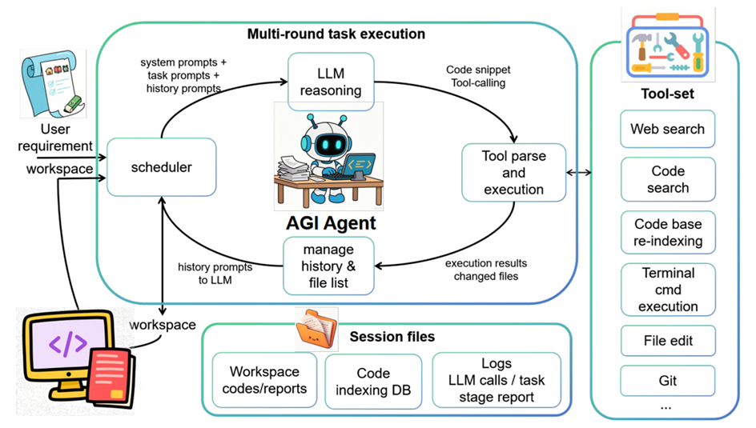
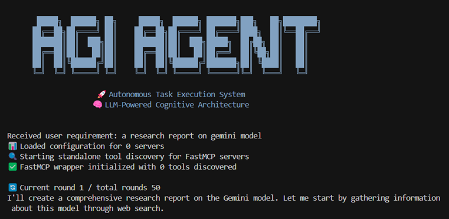

# AGI Agent

[**中文**](README_zh.md) | **English**

## 🚀 Project Introduction

**AGI Agent** is an L3-level fully automated general-purpose intelligent agent powered by Large Language Models (LLM). It employs a multi-round iterative working mechanism where the large model can make tool calls and receive feedback results in each round. It is used to update files in the workspace or change the external environment through tools according to user needs. AGIAgent can autonomously call a wide range of MCP tools and operating system tools, featuring multi-agent collaboration, multi-level long-term memory, and embodied intelligence perception. It emphasizes the generality and autonomous decision-making capabilities of the agent. AGIAgent's extensive operating system support, large model support, and multiple operation modes make it suitable for building human-like general intelligence systems to achieve complex report research and generation, project-level code writing, automatic computer operation, multi-agent research (such as competition, debate, collaboration) and other applications.


<div align="center">
      
</div>

## 🚀 News

2025/10/27 AGIAgent online registration is now open! Click the registration button on the right side of <https://agiagentonline.com> to register and start using.

2025/10/12 An introduction of AGIAgent for Article Generation with Rich Images is provided in [colourfuldoc/ColourfulDoc.md](colourfuldoc/ColourfulDoc.md) and [colourfuldoc/ColourfulDoc_zh.md](colourfuldoc/ColourfulDoc_zh.md) (in Chinese).

2025/10/10 Windows installation package (online / offline) is ready! See [release page](https://github.com/agi-hub/AGIAgent/releases/).

2025/9/15 Online website (in Chinese) is available. Access <https://agiagentonline.com>，login without APIKey, you can find many examples. Project introduction homepage: <https://agiagentonline.com/intro> (in Chinese) is avaliable. 

2025/7/21 GUI is available, with markdown/PDF/sourcecode preview, with svg image edit and mermaid edit capability, visit [GUI/README_GUI_en.md](GUI/README_GUI_en.md) for more information, and the same GUI is deployed on <https://agiagentonline.com>.

## ✨ Core Features

### 🤖 Autonomous Multi-Agent Collaboration
- **Autonomous Agent Creation**: The system can autonomously decide to create new professional agents, configuring unique prompts, model types, and dedicated tool libraries for each agent
- **Role Specialization**: Build sub-agents with different roles and specialized expertise working efficiently together in a shared workspace
- **Communication Mechanism**: Agents have point-to-point and broadcast message communication capabilities, integrated with email viewing mechanisms for seamless interconnection

### 🔧 Extensive Tool Calling Capabilities
- **Built-in Tool Library**: Integrates over 10 common development tools including file retrieval, web browsing, and file modification
- **MCP Protocol Support**: Supports Model Context Protocol (MCP) for connecting thousands of extended tools such as GitHub and Slack
- **System Integration**: Full support for terminal commands, Python package management, and operating system software packages
- **Autonomous Installation**: Agents can automatically install system software, pip packages, and MCP tools according to task requirements

### 🧠 Long-term Memory and Learning
- **Persistent Memory**: Solves the limitation of traditional agents that only focus on current tasks by storing historical execution summaries to form long-term memory
- **Intelligent Retrieval**: Extracts valuable historical memory elements for current work through RAG (Retrieval-Augmented Generation)
- **Context Management**: Integrates long-context summarization mechanisms to ensure memory continuity and relevance

### 👁️ Embodied Intelligence and Multimodal
- **Multimodal Perception**: Built-in vision, sensors, and other multimodal capabilities, not limited to the text world
- **Physical World Interaction**: Can handle rich physical world information scenarios
- **Multi-channel Information Processing**: Achieves parallel information perception and interaction through multi-agent architecture

### 🔗 Flexible Deployment Methods
- **Independent Operation**: Can run independently as a complete autonomous system
- **Embedded Integration**: Can be embedded as a Python component into other software processes
- **Modular Design**: Uses a building-block approach to construct powerful intelligent systems
- **Lightweight Deployment**: Depends only on a few core libraries, with a compact software package and strong system compatibility

## 🔄 Working Principle

### Input-Output Mechanism
AGI Agent receives **user prompts** and **working directory** as input, and outputs **processed working directory**. All generated code, documents, and other files are uniformly placed in the workspace folder.

### Multi-round Iterative Process
1. **Task Analysis Phase**: The system sends user prompts, historical chat records, and previous tool execution results to the large model
2. **Decision Making Phase**: The large model autonomously decides the tool calling strategy for the next round (file writing, code search, terminal commands, etc.)
3. **Tool Execution Phase**: The tool execution module parses and executes the large model's instructions (supports tool_call and JSON formats)
4. **Result Feedback Phase**: Execution results are passed to the large model in the next round, forming a closed-loop feedback
5. **Task Completion Phase**: The large model issues an end signal when it determines the task is complete, and can optionally generate a task summary

### Intelligent Optimization Features
- **Context Management**: Automatically triggers historical summarization when chat history exceeds the threshold to maintain efficient operation
- **Network Search Optimization**: Search results can be selectively summarized to extract key information
- **Security Boundaries**: All editing operations are limited within the user-defined working directory to ensure system security

## ⚠️ Security Notice

As a general-purpose task agent, AGI Agent has the capability to call system terminal commands. Although it usually does not operate files outside the working directory, the large model may execute software installation commands (such as pip, apt, etc.). Please pay attention when using:
- Carefully review executed commands
- Recommend running important tasks in a sandbox environment
- Regularly backup important data

## 🌐 Platform Compatibility

### Operating System Support
- ✅ **Linux** - Full support
- ✅ **Windows** - Full support  
- ✅ **MacOS** - Full support

### Large Model Support
- **Anthropic Claude** - Claude 3.5 Sonnet, Claude 3 Opus, etc.
- **OpenAI GPT** - GPT-4, GPT-4 Turbo, GPT-3.5, etc.
- **Google Gemini** - Gemini Pro, Gemini Ultra, etc.
- **Domestic Models** - Kimi K2, DeepSeek, Volcano Large Model, Qwen3 (8B and above)

### Interfaces and Modes
- **API Interface**: Supports Anthropic interface and OpenAI-compatible interface
- **Output Mode**: Supports streaming output and batch output
- **Calling Mode**: Supports Tool Calling mode and traditional Chat mode (tool calling mode works better)

### Runtime Interfaces
- **Terminal Mode**: Pure command-line interface, suitable for servers and automation scenarios
- **Python Library Mode**: Embedded as a component in other Python applications
- **Web Interface Mode**: Modern web interface providing visual operation experience

### Interaction Modes
- **Fully Automatic Mode**: Completely autonomous execution without human intervention
- **Interactive Mode**: Supports user confirmation and guidance, providing more control


<br/>

## 🎬 Demo Video

[](https://www.youtube.com/watch?v=7kW_mH18YFM)

> If you cannot play directly, please [click here to watch the demo video](https://www.youtube.com/watch?v=7kW_mH18YFM)

## 📋 Demo Cases

To understand AGI Agent's comprehensive capabilities in various scenarios, please check our [Demo Cases](md/DEMO.md). This includes real use cases, output files, and detailed examples of what AGI Agent can accomplish.

## 🔗 Extended Features

### 🐍 Python Library Interface
AGI Agent now supports being called directly as a Python library in code, providing a programming interface similar to the OpenAI Chat API.

**📖 [View Python Library Usage Guide →](md/README_python_lib.md)**

- 🐍 Pure Python interface, no command line needed
- 💬 OpenAI-style API, easy to integrate
- 🔧 Programmatic configuration, flexible control
- 📊 Detailed return information and status

### 🔌 MCP Protocol Support
Supports Model Context Protocol (MCP) for communication with external tool servers, greatly expanding the system's tool ecosystem.

**📖 [View MCP Integration Guide →](md/README_MCP.md)**

- 🌐 Standardized tool calling protocol
- 🔧 Support for official and third-party MCP servers
- 📁 File system, GitHub, Slack, and other service integrations
- ⚡ Dynamic tool discovery and registration

## 🚀 Quick Start

**Experience AGI Agent for free in Google Colab with no configuration required!**

[](https://colab.research.google.com/drive/1JttmqQxV8Yktl4zDmls1819BCnM0_zRE)

*Click the badge above to launch AGI Agent directly in your browser and start experiencing autonomous AI programming.*

### Basic Usage

#### 🔥 Single Task Mode (Recommended)
Suitable for single-objective tasks such as bug fixes and feature optimization. If no `-r` parameter is specified, the program will prompt you to enter a task description, supporting multi-line complex prompts.

```bash
python agia.py --requirement "Search today's news"
python agia.py -r "Write a joke"

# Image input support
python agia.py -r "Analyze this chart: [img=chart.png]"

# MCP tool integration
python agia.py -r "Use AISearch_search to search for AI news"
```

#### 💬 Interactive Mode
Provides a more flexible interactive experience where the system guides you to input task requirements.

```bash
python agia.py -i
python agia.py --interactive 
```

#### 📁 Specify Output Directory
Customize project output location. If not specified, the system will automatically create an `output_` directory with timestamp.

```bash
python agia.py --dir "my_dir"
```

#### 🔄 Continue Task Execution
Resume previous task execution. AGI Agent remembers the last used output directory.

```bash
python agia.py -c
python agia.py --continue
```

> **Note**: Continue execution only restores the working directory and the last requirement prompt, not the large model's context.

#### ⚡ Set Execution Rounds
Control the maximum number of task execution rounds to avoid infinite loops.

```bash
python agia.py --loops 5 -r "Requirement description"
python agia.py -d "my_dir" -l 10 -r "Requirement description"
```

> **Note**: Rounds do not equal model call count. Each round usually calls the large model once, but may call it an additional time for summarization when chat history is too long, and may also summarize after task completion.

#### 🔧 Custom Model Configuration
Directly specify API configuration through command line, but it's recommended to configure in `config/config.txt` for reuse.

```bash
python agia.py --api-key YOUR_KEY --model gpt-4 --api-base https://api.openai.com/v1
```

## 🎯 Core Features

- **🧠 Intelligent Task Decomposition**: AI automatically decomposes complex requirements into executable subtasks
- **🔄 Multi-round Iterative Execution**: Each task supports multi-round optimization to ensure quality (default 50 rounds)
- **🔍 Intelligent Code Search**: Semantic search + keyword search for quick code location
- **🌐 Network Search Integration**: Real-time network search for latest information and solutions
- **📚 Codebase Retrieval**: Advanced code repository analysis and intelligent code indexing
- **🛠️ Rich Tool Ecosystem**: Complete local tools + operating system command calling capabilities, supporting full development processes
- **🖼️ Image Input Support**: Use `[img=path]` syntax to include images in requirements, supporting Claude and OpenAI vision models
- **🔗 MCP Integration Support**: Integrate external tools through Model Context Protocol, including third-party services like AI search
- **🖥️ Web Interface**: Intuitive web interface with real-time execution monitoring
- **📊 Dual Format Reports**: JSON detailed logs + Markdown readable reports
- **⚡ Real-time Feedback**: Detailed execution progress and status display
- **🤝 Interactive Control**: Optional user confirmation mode with step-by-step control
- **📁 Flexible Output**: Custom output directory with automatic timestamp naming for new projects

## 🌐 Network Search Function

AGI Agent integrates powerful network search functionality to obtain real-time information:

Usage: Add "search web" in the requirement prompt to perform search, "don't search web" to avoid search. If not specified, the large model will decide autonomously.

## 📚 Codebase Retrieval System

AGI Agent is equipped with real-time codebase vectorization and retrieval functionality. After each round of tool calls, it searches for newly modified files, performs dynamic incremental indexing, and supports the large model's fuzzy semantic retrieval capability. Additionally, the large model can call commands like grep to observe the workspace situation.

## 🛠️ Tool Library

AGI Agent has a comprehensive tool library:

### File System Tools
- **File Operations**: Create, read, update, delete files and directories
- **Directory Management**: Navigate and organize project structure
- **File Search**: Find files by name, content, or pattern

### Code Analysis Tools
- **Syntax Analysis**: Parse and understand code structure
- **Dependency Analysis**: Map code relationships and imports
- **Code Quality**: Identify issues and suggest improvements

### Network and Web Tools
- **Web Search**: Real-time information retrieval
- **API Testing**: Test and validate API endpoints
- **Documentation Retrieval**: Retrieve technical documentation

### Terminal and Execution Tools
- **Command Execution**: Run system commands and scripts
- **Process Management**: Monitor and control running processes
- **Environment Setup**: Configure development environments

### Development Tools
- **Code Generation**: Create boilerplate and template code
- **Testing Tools**: Generate and run test cases
- **Build Tools**: Compile and package applications

## 🖥️ Web GUI Interface

AGI Agent provides a modern, intuitive web interface to enhance user experience:

### Main Features
- **Real-time Execution Monitoring**: Real-time observation of task execution and detailed logs
- **Interactive Task Management**: Start, stop, and monitor tasks through the web interface
- **File Management**: Upload, download, and manage project files directly in the browser
- **Directory Operations**: Create, rename, and organize project directories
- **Multi-language Support**: Includes Chinese and English interfaces, configure language in config/config.txt

### Launch GUI
```bash
cd GUI
python app.py

# Access through browser at http://localhost:5001
```
Web GUI displays file lists. Folders with workspace subdirectories are listed by default, otherwise they won't be shown. The root directory location can be configured in config/config.txt.
Note: Web GUI is currently experimental, providing only a single-user development version (not suitable for industrial deployment).

## 🤖 Model Selection

AGI Agent supports various mainstream AI models including Claude, GPT-4, DeepSeek V3, Kimi K2, etc., meeting different user needs and budgets.

**🎯 [View Detailed Model Selection Guide →](md/MODELS.md)**

### Quick Recommendations

- **🏆 Quality First**: Claude Sonnet 4 - Best intelligence and code quality
- **⚡ Balanced Performance**: GPT-4 Turbo - Perfect balance of speed and quality  
- **💰 Cost-Effective**: DeepSeek V3 - Excellent cost-effectiveness ratio
- **🤖 Agent Optimized**: Kimi K2 - Excellent Agent and coding performance
- **🆓 Free Trial**: Qwen2.5-7B - Zero cost learning and simple tasks

> 💡 **Tip**: For detailed model comparisons, configuration methods, and performance optimization suggestions, please refer to [MODELS.md](md/MODELS.md)

## ⚙️ Configuration Files

AGI Agent uses `config/config.txt` and `config/config_memory.txt` files for system configuration.

### Quick Configuration
After installation, please configure the following basic options:

```ini
# Required configuration: API key and model
api_key=your_api_key
api_base=https://api.openai.com/v1
model=gpt-4

# Language setting
LANG=en
```

> 💡 **Tip**: For detailed configuration options, usage suggestions, and troubleshooting, please refer to [CONFIG.md](md/CONFIG.md)

## 🔧 Environment Requirements and Installation

### System Requirements
- **Python 3.6+**
- **Network Connection**: For API calls and network search functionality

### Installation Steps

```bash
# Install from source
pip install -r requirements.txt

# Install web scraping tools (if web scraping is needed)
playwright install-deps
playwright install chromium
```

After installation, don't forget to configure api key, api base, model, and language setting LANG=en in config/config.txt. 
