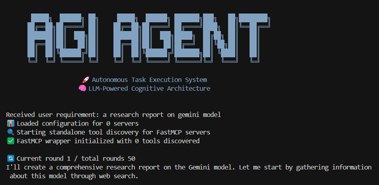

# AGI Agent

**中文** | [**English**](README.md)

## 🚀 项目简介

**AGI Agent** 是一个由大语言模型（LLM）驱动的L3级别全流程自动化通用智能体。其采用多轮迭代的工作机制，大模型可在每轮进行工具调用并收到反馈结果。用于根据用户需求，更新工作区的文件或通过工具改变外部环境。AGIAgent可以自主调用广泛的MCP工具及操作系统工具，具有多智能体协同、多层次长期记忆、具身智能感知等特色。强调智能体的通用性及自主决策能力。AGIAgent广泛的操作系统支持、大模型支持、多种运行模态支持，可用于构建拟人的通用智能系统，实现复杂报告调研与生成、项目级代码编写、计算机自动运行、多智能体研究（如竞争、辩论、协作）等应用。


<div align="center">
      
</div>

## 🚀 最新动态

2025/10/12 AGIAgent富图像文档撰写功能介绍已发布，详见 [colourfuldoc/ColourfulDoc_zh.md](colourfuldoc/ColourfulDoc_zh.md) 和 [colourfuldoc/ColourfulDoc.md](colourfuldoc/ColourfulDoc.md)（英文版）。

2025/10/10 Windows安装包（在线/离线版本）已准备就绪！请查看[发布页面](https://github.com/agi-hub/AGIAgent/releases/)。

2025/9/15 在线网站（中文版）已上线。访问 <https://agiagentonline.com>，无需APIKey即可登录，您可以找到许多示例。项目介绍主页：<https://agiagentonline.com/intro>（中文版）已可用。

## ✨ 核心特性

### 🤖 自主多智能体协作
- **智能体自主创建**：系统可自主决定创建新的专业智能体，为每个智能体配置独特的提示词、模型类型和专用工具库
- **角色专业化**：构建不同角色、术业专攻的子智能体，在共享工作空间下高效协同工作
- **通信机制**：智能体间具备点对点及广播消息通信能力，集成邮箱信件查看机制，实现无缝互联互通

### 🔧 广泛的工具调用能力
- **内置工具库**：集成文件检索、网页浏览、文件修改等10余种常用开发工具
- **MCP协议支持**：支持模型上下文协议（MCP），可外接GitHub、Slack等数千种扩展工具
- **系统集成**：全面支持终端命令、Python包管理、操作系统软件包等通用工具
- **自主安装**：智能体可根据任务需求自动安装系统软件、pip包和MCP工具

### 🧠 长程记忆与学习
- **持久化记忆**：解决传统智能体只关注当前任务的局限，将历史执行情况摘要存储形成长期记忆
- **智能检索**：通过RAG（检索增强生成）方式提取对当前工作有价值的历史记忆元素
- **上下文管理**：集成长上下文总结机制，确保记忆的连续性和相关性

### 👁️ 具身智能与多模态
- **多模态感知**：内置视觉、传感器等多模态能力，不局限于文本世界
- **物理世界交互**：可处理丰富的物理世界信息场景
- **多路信息处理**：通过多智能体架构实现并行信息感知与交互

### 🔗 灵活的部署方式
- **独立运行**：可作为完整的自主系统独立运行
- **嵌入式集成**：作为Python组件嵌入其他软件流程
- **模块化设计**：采用搭积木方式构建强大的智能系统
- **轻量级部署**：仅依赖少量核心库，软件包小巧，系统兼容性强

## 🔄 工作原理

### 输入输出机制
AGI Agent接收**用户提示词**和**工作目录**作为输入，输出**处理后的工作目录**，所有生成的代码、文档等文件都统一放置在workspace文件夹中。

### 多轮迭代流程
1. **任务分析阶段**：系统将用户提示词、历史聊天记录、上轮工具执行结果发送给大模型
2. **决策制定阶段**：大模型自主决定下一轮的工具调用策略（文件编写、代码搜索、终端命令等）
3. **工具执行阶段**：工具执行模块解析并执行大模型的指令（支持tool_call和JSON格式）
4. **结果反馈阶段**：执行结果在下一轮传递给大模型，形成闭环反馈
5. **任务完成阶段**：大模型判断任务完成后发出结束信号，可选择性生成任务总结

### 智能优化特性
- **上下文管理**：当聊天历史超过阈值时自动触发历史总结，保持高效运行
- **网络搜索优化**：搜索结果可选择性总结，提取关键信息
- **安全边界**：所有编辑操作限制在用户定义的工作目录内，确保系统安全

## ⚠️ 安全提醒

AGI Agent作为通用任务智能体，具备调用系统终端命令的能力。虽然通常不会操作工作目录外的文件，但大模型可能会执行软件安装命令（如pip、apt等）。请在使用时注意：
- 仔细审查执行的命令
- 建议在沙盒环境中运行重要任务
- 定期备份重要数据

## 🌐 平台兼容性

### 操作系统支持
- ✅ **Linux** - 完全支持
- ✅ **Windows** - 完全支持  
- ✅ **MacOS** - 完全支持

### 大模型支持
- **Anthropic Claude** - Claude 3.5 Sonnet、Claude 3 Opus等
- **OpenAI GPT** - GPT-4、GPT-4 Turbo、GPT-3.5等
- **Google Gemini** - Gemini Pro、Gemini Ultra等
- **国产模型** - Kimi K2、DeepSeek、火山大模型、Qwen3（8B及以上）

### 接口与模式
- **API接口**：支持Anthropic接口和OpenAI兼容接口
- **输出模式**：支持流式（Streaming）输出和批量输出
- **调用模式**：支持Tool Calling模式和传统Chat模式（工具调用模式效果更佳）

### 运行界面
- **终端模式**：纯命令行界面，适合服务器和自动化场景
- **Python库模式**：作为组件嵌入其他Python应用
- **Web界面模式**：现代化网页界面，提供可视化操作体验

### 交互模式
- **全自动模式**：完全自主执行，无需人工干预
- **交互模式**：支持用户确认和指导，提供更多控制权


<br/>

## 🎬 演示视频

[](https://www.youtube.com/watch?v=7kW_mH18YFM)

> 如果无法直接播放，请[点击这里观看演示视频](https://www.youtube.com/watch?v=7kW_mH18YFM)

## 📋 演示案例

想要了解 AGI Agent 在各种场景下的综合能力展示，请查看我们的[演示案例](md/DEMO_zh.md)。这包括真实的使用案例、输出文件和 AGI Agent 能够完成的详细示例。

## 🔗 扩展功能

### 🐍 Python 库接口
AGI Agent 现在支持作为 Python 库直接在代码中调用，提供类似 OpenAI Chat API 的编程接口。

**📖 [查看 Python 库使用指南 →](md/README_python_lib_zh.md)**

- 🐍 纯 Python 接口，无需命令行
- 💬 OpenAI 风格 API，易于集成
- 🔧 编程式配置，灵活控制
- 📊 详细返回信息和状态

### 🔌 MCP 协议支持
支持 Model Context Protocol (MCP) 协议，可与外部工具服务器通信，大大扩展系统工具生态。

**📖 [查看 MCP 集成指南 →](md/README_MCP_zh.md)**

- 🌐 标准化工具调用协议
- 🔧 支持官方和第三方 MCP 服务器
- 📁 文件系统、GitHub、Slack 等服务集成
- ⚡ 动态工具发现和注册

## 🚀 立即体验

**在Google Colab中免费体验AGI Agent，无需任何配置！**

[](https://colab.research.google.com/drive/1eFtyTz1ictFBDDJFvI0viImfNvkTFOVc)

*点击上方徽章，直接在浏览器中启动AGI Agent并开始体验自主AI编程。*

### 基本使用

#### 🔥 单任务模式（推荐）
适合Bug修复、功能优化等单一目标任务。如果没有指定`-r`参数，程序会提示您输入任务描述，支持多行复杂提示词。

```bash
python agia.py --requirement "搜索今日新闻"
python agia.py -r "写一个笑话"

# 图像输入支持
python agia.py -r "分析这张图表：[img=chart.png]"

# MCP工具集成
python agia.py -r "使用AISearch_search搜索AI新闻"
```

#### 📋 任务分解模式
适合复杂的多步骤任务，系统会自动将大任务分解为子任务逐步执行。

```bash
python agia.py --todo --requirement "开发一个完整的博客系统"
```

#### 💬 交互模式
提供更灵活的交互体验，系统会引导您输入任务需求。

```bash
python agia.py -i
python agia.py --interactive 
```

#### 📁 指定输出目录
自定义项目输出位置。如果不指定，系统会自动创建带时间戳的`output_`目录。

```bash
python agia.py --dir "my_dir"
```

#### 🔄 继续执行任务
恢复之前的任务继续执行。AGI Agent会记住最后一次使用的输出目录。

```bash
python agia.py -c
python agia.py --continue
```

> **注意**：继续执行仅恢复工作目录和上一次的需求提示词，不会恢复大模型的上下文。

#### ⚡ 设置执行轮数
控制任务执行的最大轮数，避免无限循环。

```bash
python agia.py --loops 5 -r "需求描述"
python agia.py -d "my_dir" -l 10 -r "需求描述"
```

> **说明**：轮数不等于模型调用次数。每轮通常调用一次大模型，但在聊天历史过长时会额外调用一次进行总结，任务完成后也可能进行总结。

#### 🔧 自定义模型配置
直接通过命令行指定API配置，但建议在`config/config.txt`中配置以便重复使用。

```bash
python agia.py --api-key YOUR_KEY --model gpt-4 --api-base https://api.openai.com/v1
```

## 🎯 核心特性

- **🧠 智能任务分解**：AI自动将复杂需求分解为可执行子任务
- **🔄 多轮迭代执行**：每个任务支持多轮优化，确保质量（默认50轮）
- **🔍 智能代码搜索**：语义搜索 + 关键词搜索，快速定位代码
- **🌐 网络搜索集成**：实时网络搜索获取最新信息和解决方案
- **📚 代码库检索**：高级代码仓库分析和智能代码索引
- **🛠️ 丰富工具生态**：完备的本地工具+操作系统命令调用能力，支持完整开发流程
- **🖼️ 图像输入支持**：使用`[img=路径]`语法在需求中包含图像，支持Claude和OpenAI视觉模型
- **🔗 MCP集成支持**：通过模型上下文协议集成外部工具，包含AI搜索等第三方服务
- **🖥️ Web界面**：直观的网页界面，实时执行监控
- **📊 双格式报告**：JSON详细日志 + Markdown可读报告
- **⚡ 实时反馈**：详细的执行进度和状态显示
- **🤝 交互式控制**：可选的用户确认模式，每步骤可控
- **📁 灵活输出**：自定义输出目录，自动时间戳命名新工程

## 🌐 网络搜索功能

AGI Agent 集成了强大的网络搜索功能，可以获取实时信息：

使用方式：在需求提示词中加入"搜索网页"则会进行搜索，"不要搜索网页"则不会搜索，如不注明则大模型会自行判断。

## 📚 代码库检索系统

AGI Agent配备了实时代码库的向量化和检索功能，在每轮工具调用结束后，会搜索新修改的文件，进行动态增量入库，并支持大模型的模糊语义检索能力。此外，大模型也可以调用grep等命令观察工作空间的情况。


## 🛠️ 工具库

AGI Agent 拥有全面的工具库：

### 文件系统工具
- **文件操作**：创建、读取、更新、删除文件和目录
- **目录管理**：导航和组织项目结构
- **文件搜索**：按名称、内容或模式查找文件

### 代码分析工具
- **语法分析**：解析和理解代码结构
- **依赖分析**：映射代码关系和导入
- **代码质量**：识别问题并提出改进建议

### 网络和网络工具
- **网络搜索**：实时信息检索
- **API测试**：测试和验证API端点
- **文档获取**：检索技术文档

### 终端和执行工具
- **命令执行**：运行系统命令和脚本
- **进程管理**：监控和控制运行中的进程
- **环境设置**：配置开发环境

### 开发工具
- **代码生成**：创建样板和模板代码
- **测试工具**：生成和运行测试用例
- **构建工具**：编译和打包应用程序

## 🖥️ Web GUI 界面

AGI Agent 提供现代化、直观的网页界面，提升用户体验：

### 主要功能
- **实时执行监控**：实时观察任务执行和详细日志
- **交互式任务管理**：通过网页界面启动、停止和监控任务
- **文件管理**：直接在浏览器中上传、下载和管理项目文件
- **目录操作**：创建、重命名和组织项目目录
- **多语言支持**：包含中英文界面，请在config/config.txt中配置语言

### 启动 GUI
```bash
cd GUI
python app.py

# 通过浏览器访问 http://localhost:5001
```
Web GUI会显示文件列表，默认带有workspace子目录的文件夹都会被列出，否则不会被列出。根目录位置可以在config/config.txt中配置。
注：目前Web GUI处于实验阶段，仅提供单用户开发版本（不适合工业部署）。


## 🤖 模型选择

AGI Agent 支持多种主流AI模型，包括Claude、GPT-4、DeepSeek V3、Kimi K2等，满足不同用户的需求和预算。

**🎯 [查看详细模型选择指南 →](md/MODELS_zh.md)**

### 快速推荐

- **🏆 追求质量**：Claude Sonnet 4 - 最佳智能程度和代码质量
- **⚡ 平衡性能**：GPT-4 Turbo - 速度与质量的完美平衡  
- **💰 性价比高**：DeepSeek V3 - 极佳的成本效益比
- ** Agent 优化**：Kimi K2 - 优秀的Agent和编码性能
- **🆓 免费试用**：Qwen2.5-7B - 零成本学习和简单任务

> 💡 **提示**：详细的模型对比、配置方法、性能优化建议请参考 [MODELS_zh.md](md/MODELS_zh.md)

## ⚙️ 配置文件

AGI Agent 使用 `config/config.txt` 和 `config/config_memory.txt` 文件进行系统配置。


### 快速配置
安装完成后，请配置以下基本选项：

```ini
# 必需配置：API密钥和模型
api_key=your_api_key
api_base=https://api.openai.com/v1
model=gpt-4

# 语言设置
LANG=zh
```

> 💡 **提示**：详细的配置选项、使用建议和故障排除请参考 [CONFIG_zh.md](md/CONFIG_zh.md)

## 🔧 环境要求与安装

### 系统要求
- **Python 3.6+**
- **网络连接**：用于API调用和网络搜索功能

### 安装步骤

```bash
# 从源码安装
pip install -r requirements.txt

# 安装网页抓取工具(如果需要网页抓取)
playwright install-deps
playwright install chromium

```

安装完成后，请不要忘记到config/config.txt中配置api key, api base和model, 以及语言设置LANG=zh.