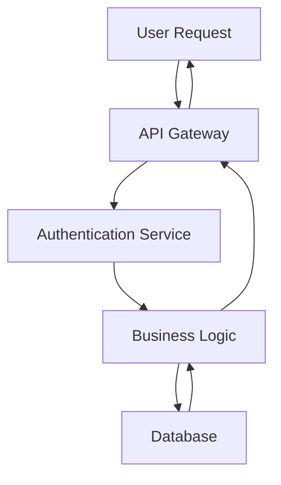
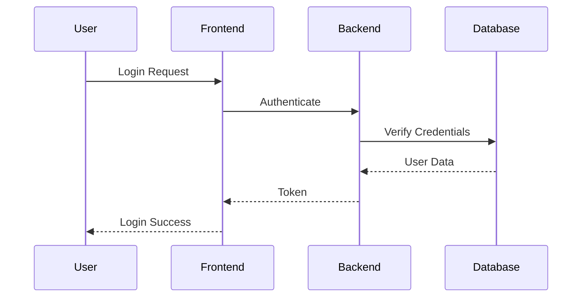

# Mermaid Processing Feature Example

This document demonstrates the automatic Mermaid chart processing feature in AGI Bot's file editing tools.

## Overview

When editing markdown files, the system automatically:
1. Detects Mermaid chart code blocks
2. Converts them to images using the best available method (CLI, Playwright, Python library, or online API)
3. Replaces the code blocks with image references
4. Creates an `images/` directory to store generated charts

## Example Usage

### Before Editing

Create a markdown file with Mermaid charts:

```markdown
# Project Architecture

## System Flow



## Sequence Diagram


```

### Edit the File

```python
from src.tools.file_system_tools import FileSystemTools

tools = FileSystemTools()
result = tools.edit_file(
    target_file='architecture.md',
    edit_mode='append',
    code_edit='\n## Additional Notes\nThis architecture supports scalable operations.'
)

# Check processing results
if 'mermaid_processing' in result:
    mermaid_info = result['mermaid_processing']
    print(f"Processed {mermaid_info['charts_processed']} out of {mermaid_info['charts_found']} charts")
```

### After Processing

The file will be automatically updated:

```markdown
# Project Architecture

## System Flow


## Sequence Diagram


## Additional Notes
This architecture supports scalable operations.
```

### Generated Files

```
project/
├── architecture.md          # Updated markdown file
└── images/
    ├── mermaid_1.png        # System flow diagram
    └── mermaid_2.png        # Sequence diagram
```

## API Response Structure

When Mermaid processing occurs, the edit response includes additional information:

```python
{
    'status': 'success',
    'file': 'architecture.md',
    'action': 'appended',
    'edit_mode': 'append',
    'snapshot_created': True,
    'mermaid_processing': {
        'status': 'success',
        'file': '/path/to/architecture.md',
        'charts_found': 2,
        'charts_processed': 2,
        'images_dir': '/path/to/images',
        'message': 'Successfully processed 2/2 Mermaid charts'
    }
}
```

## Error Handling

If chart generation fails (e.g., CLI not installed or syntax errors), the original Mermaid code is preserved:

```python
{
    'mermaid_processing': {
        'status': 'success',
        'charts_found': 2,
        'charts_processed': 1,  # Only 1 out of 2 succeeded
        'message': 'Successfully processed 1/2 Mermaid charts'
    }
}
```

## Benefits

1. **Automatic Processing**: No manual intervention required
2. **Local Processing**: No dependency on external services, more reliable and faster
3. **Preserved Backups**: File snapshots are created before processing
4. **Robust Error Handling**: Failed conversions don't break the editing process
5. **Clear Feedback**: Detailed processing results in API responses
6. **Universal Compatibility**: Generated PNG images work in all markdown viewers

## Prerequisites (Optional)

For best performance, install one or more of the following:

### Option 1: Mermaid CLI (Recommended)
```bash
npm install -g @mermaid-js/mermaid-cli
```

### Option 2: Playwright (Alternative)
```bash
pip install playwright
playwright install chromium
```

### Option 3: Python Mermaid Library
```bash
pip install mermaid
```

### Option 4: No Installation Required
The system will automatically fall back to the online API if no local tools are available.

## Rendering Method Selection

The system automatically selects the best available method:

1. **CLI Method**: Fastest, requires Node.js setup
2. **Playwright Method**: Good compatibility, requires browser installation
3. **Python Library**: Pure Python, may have dependency issues
4. **Online Fallback**: Always available, requires internet

This feature enhances document creation workflows by automatically generating visual diagrams from code with smart fallback options, making technical documentation more accessible and professional.