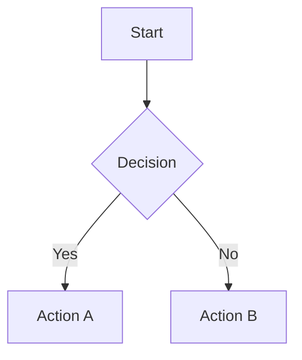

# AGI Bot Tools Utilities

This directory contains utility modules for various tool functionalities.

## Mermaid Processor (`mermaid_processor.py`)

The Mermaid Processor utility automatically converts Mermaid chart code blocks in markdown files to images using multiple rendering methods with automatic fallback.

### Features

- **Automatic Detection**: Detects Mermaid code blocks in markdown files (```mermaid ... ```)
- **Multiple Rendering Methods**: Supports CLI, Playwright, Python library, and online API
- **Smart Fallback**: Automatically tries different methods if the preferred one fails
- **Image Management**: Creates `images/` directory and saves generated charts
- **Content Replacement**: Replaces Mermaid code blocks with image references
- **Integrated Processing**: Automatically triggered when editing markdown files via `edit_file`

### Usage

#### Automatic Processing (Recommended)

The Mermaid processor is automatically triggered when editing markdown files:

```python
from src.tools.file_system_tools import FileSystemTools

tools = FileSystemTools()
result = tools.edit_file(
    target_file='document.md',
    edit_mode='append',
    code_edit='## New Section\nContent with Mermaid charts'
)

# Check if Mermaid processing occurred
if 'mermaid_processing' in result:
    mermaid_result = result['mermaid_processing']
    print(f"Charts processed: {mermaid_result['charts_processed']}/{mermaid_result['charts_found']}")
```

#### Manual Processing

You can also process markdown files directly:

```python
from src.tools.utils.mermaid_processor import mermaid_processor

# Process a single file
result = mermaid_processor.process_markdown_file('document.md')

# Process all markdown files in a directory
result = mermaid_processor.scan_and_process_directory('/path/to/directory')

# Check if a file contains Mermaid charts
has_charts = mermaid_processor.has_mermaid_charts('document.md')
```

### Supported Mermaid Chart Types

The processor supports all Mermaid chart types that are compatible with the available rendering methods:

- Flowcharts
- Sequence diagrams
- Class diagrams
- State diagrams
- Entity relationship diagrams
- User journey diagrams
- Gantt charts
- Pie charts
- And more...

### Example

**Before processing:**
```markdown
# My Document


```

**After processing:**
```markdown
# My Document


```

### Rendering Methods

The processor automatically selects the best available method in this order:

1. **Mermaid CLI (mmdc)**: Fastest and most reliable when available
   - Install: `npm install -g @mermaid-js/mermaid-cli`
   - Requires: Node.js, npm, and puppeteer dependencies

2. **Playwright**: Browser-based rendering, good compatibility
   - Install: `pip install playwright && playwright install chromium`
   - Uses: Chromium browser in headless mode

3. **Python mermaid library**: Pure Python implementation
   - Install: `pip install mermaid` (note: may have dependency issues)
   - Alternative to CLI for Python environments

4. **Online API**: Fallback option using mermaid.ink
   - No installation required
   - Requires: Internet connection
   - Less reliable due to network dependency

### Configuration

- **Image Format**: PNG with transparent background
- **Image Directory**: `images/` (relative to markdown file)
- **Method Selection**: Automatic based on availability

### Error Handling

- **Smart Fallback**: If the preferred method fails, automatically tries other available methods
- **Graceful Degradation**: If all methods fail, the original Mermaid code block is preserved
- **Detailed Logging**: Processing attempts and errors are logged for debugging
- **Non-blocking**: Chart generation failures don't prevent file editing
- **Syntax Validation**: Invalid Mermaid syntax is handled gracefully

### Dependencies

**Optional (for different rendering methods):**
- `@mermaid-js/mermaid-cli`: CLI method (install with `npm install -g @mermaid-js/mermaid-cli`)
- `playwright`: Browser rendering (install with `pip install playwright && playwright install chromium`)
- `mermaid`: Python library (install with `pip install mermaid`)
- `requests`: Online API fallback (usually pre-installed)

**Built-in Python modules:**
- `subprocess`: For CLI command execution
- `tempfile`: For temporary file handling
- `pathlib`: For file path handling
- `re`: For pattern matching
- `base64`: For API encoding

### Integration

This utility is automatically integrated into the `FileSystemTools.edit_file()` method:

1. When editing a markdown file (`.md` extension)
2. After successful file write operation
3. If Mermaid charts are detected in the file
4. Processing results are included in the edit response

The integration ensures that any markdown file editing automatically processes Mermaid charts without additional user intervention.